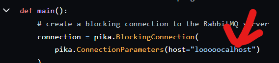
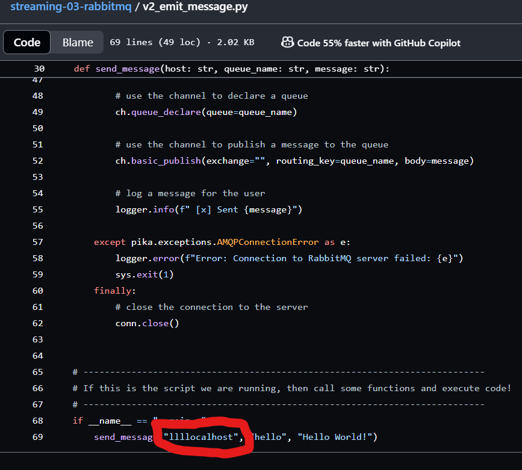
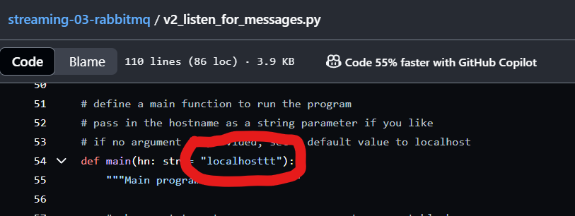

# streaming-03-rabbitmq
Student Name: Topaz Montague
Date: 5/15/2024
Project Repository: [Decoupling with a Message Broker](https://github.com/tfmontague/streaming-03-rabbitmq)

> Get started with RabbitMQ, a message broker, that enables multiple processes to communicate reliably through an intermediary.

## Prerequisites

1. Git
1. Python 3.7+ (3.11+ preferred)
1. VS Code Editor
1. VS Code Extension: Python (by Microsoft)
1. RabbitMQ Server installed and running locally

## Before You Begin

1. Fork this starter repo into your GitHub account: https://github.com/denisecase/streaming-03-rabbitmq
1. Clone your repo down to your machine. 
````python
git clone https://github.com/tfmontague/streaming-03-rabbitmq
````
1. Explore your new project repo in VS Code on your local machine.

## Task 1. Create a Python Virtual Environment

We will create a local Python virtual environment to isolate our project's third-party dependencies from other projects.

1. Open a terminal window in VS Code.
1. Use the built-in Python utility venv to create a new virtual environment named `.venv` in the current directory.

```shell
python -m venv .venv
```

Verify you get a new .venv directory in your project. 
We use .venv as the name to keep it away from our project files. 


## Task 2. Activate the Virtual Environment

In the same VS Code terminal window, activate the virtual environment.

- On Windows, run: `.venv\Scripts\activate`


Verify you see the virtual environment name (.venv) in your terminal prompt.


## Task 3. Install Dependencies into the Virtual Environment

To work with RabbitMQ, we need to install the pika library.
A library is a collection of code that we can use in our own code.
Learning to use free libraries that others have written to make our projects easier, faster, more reliable is a key skill for a developer.

We keep the list of third-party libraries needed in a file named requirements.txt.
Use the pip utility to install the libraries listed in requirements.txt into our active virtual environment. 

Make sure you can see the .venv name in your terminal prompt before running this command.

`python -m pip install -r requirements.txt`

## Task 4. Verify Setup (OPTIONAL - ONLY WORK ON SOME CONFIGURATIONS)

In your VS Code terminal window, run the following commands to help verify your setup.
These util files MAY be helpful to ensure you're setup correctly. 
You may have a different configuration and RabbitMQ may still work; the check looks in common places, but may not work for all installations. 
They are meant to be helpful, but are not required.

You can help by updating the code for other common configurations. 
Just fork the current repo, add your change, and create a pull request (no other changes please) and I'll pull it back in. 

```shell
python util_about.py
python util_aboutenv.py
pip list
```


## Task 5. Read

1. Read the [RabbitMQ Hello World! tutorial](https://www.rabbitmq.com/tutorials/tutorial-one-python.html)
1. Read the code and comments in our 2 project files: emit_message.py and listen_for_messages.py

Don't worry if it doesn't all make sense the first time. 
Approach it like a puzzle and see what you can figure out. 

## Task 6. Execute the Producer/Sender

1. Read v1_emit_message.py (and the tutorial)
1. Run the file. 

```python
python v1_emit_message.py
```

It will run, emit a message to the named RabbitMQ queue, and finish.
We can execute additional commands in the terminal as soon as it finishes. 

## Task 7. Execute the Consumer/Listener

1. Read v1_listen_for_messages.py (and the tutorial)
1. Run the file.

```python
python v1_listen_for_messages.py
```
1. Fix the typo error.



1. Save file and rerun.

```python
python v1_listen_for_messages.py
```
1. Terminate the process.

`Control + C`
 

## Task 8. Open a New Terminal / Emit More Messages

1. Open a new Anaconda Prompt terminal window and access the local project directory.

`cd C:\Users\topaz\Documents\streaming-data\streaming-03-rabbitmq`

1. Activate or verify the Python environment

`conda activate base`

1. Use this new window to run a message.py file.

`python v1_emit_message.py`

1. Watch the listening terminal and observe messages

1. Modify emit_message.py to emit a different message.


1. Execute the updated emit_message.py. 

```python
python v1_emit_message.py
```
1. Observe and repeat at least 4 times.

## Task 9. Save Time & Effort: Don't Repeat Yourself

Refactor emit_send.py to use a variable holding the message, so we only need to make the change in one place when creating a new message.

```python
import pika

# Define the message
message = "Hello, People!"

# Establish a connection with RabbitMQ server
connection = pika.BlockingConnection(pika.ConnectionParameters(host="localhost"))
channel = connection.channel()

# Declare a queue
channel.queue_declare(queue="hello")

# Publish the message
channel.basic_publish(exchange="", routing_key="hello", body=message)
print(f" [x] Sent '{message}'")

# Close the connection
connection.close()
```

## Version 2

1. Find and fix errors in v2 files.





1. Compare the structure of the version 2 files. 
1. Modify the docstrings on all your files.
1. Include your name and the date.
1. Imports always go at the top, just after the file docstring.
1. Imports should be one per line - why?
1. Then, define your functions.
1. Functions are reusable logic blocks.
1. Everything the function needs comes in through the arguments.
1. A function may - or may not - return a value. 
1. When we open a connection, we should close the connection. 
1. Which of the 4 files will always close() the connection?
1. Search GitHub for if __name__ == "__main__":
1. How many hits did you get? 
1. Learn and understand this common Python idiom.

## Reference

- [RabbitMQ Tutorial - Hello, World!](https://www.rabbitmq.com/tutorials/tutorial-one-python.html)
- [Using Python environments in VS Code](https://code.visualstudio.com/docs/python/environments)
- [RabbitMQ Get Started](https://www.rabbitmq.com/#getstarted)
- [What is RabbitMQ? IBM Intro Video 10 min](https://www.youtube.com/watch?v=7rkeORD4jSw)

